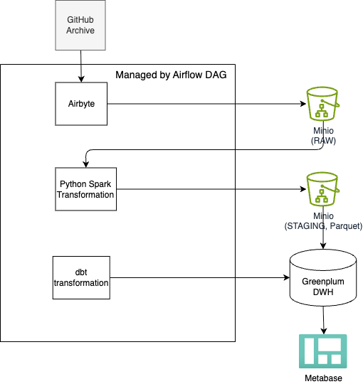

# Analytical GitHub Events mart

This project builds a complete Data Lakehouse pipeline for analyzing open-source project activity on GitHub.
It covers the full data flow — from extracting large-scale GitHub Archive events and storing them in a Data Lake (MinIO), to processing with Apache Spark, loading into Greenplum, and visualizing insights through BI dashboards.

---

## 🎯 Goal

Build a fully automated data pipeline for collecting and analyzing open-source contributions in real time.

---

## ⚙️ Architecture & Tech Stack

### 🧰 Tech Stack

* [](https://www.python.org/)
* [](https://spark.apache.org/)
* [](https://greenplum.org/)
* [](https://airflow.apache.org/)
* [](https://airbyte.com/)
* [](https://min.io/)
* [](https://www.getdbt.com/)
* [](https://www.docker.com/)
* [](https://docs.docker.com/compose/)
* [](https://www.metabase.com/)
  
---

### 📊 Architecture Overview


---

## 🔧 Implementation Details

### Data Source

---

### Data Structure

---

## 🧩 Project Structure 

---

## ▶️ Getting Started

### 🧩 Local Development

1. Clone the repository:
   ```bash
   git clone https://github.com/jinjik19/analytical_mart_github_events.git
   cd analytical_mart_github_events
   ```

2. Create environment file:
   ```bash
   cp .env.example .env
   export AIRFLOW_UID=$(id -u)
   ```

3. Run the stack:
   ```bash
   docker compose -f ./infra/docker_compose/docker-compose.dev.yml -p github_events_mart up --build -d
   ```

---

## 📊 Data Model

---